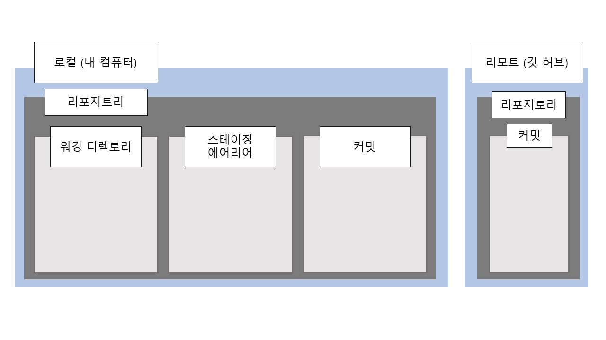

# 깃을 이용한 버전관리 

---

배운 내용을 정리하다보니 내용이 매우 지루하지만.. 한동안 깃을 만질 일이 없을 것 같고, 시간이 지나면 잊어버릴 것 같아서 미래의 나를 위해 참고 끝까지 적었다. 

> The palest ink is better than the best memory.


이전에 깃의 본질은 **분산 버전관리 시스템**이라고 배웠다. 그렇기 때문에 오늘 배운 기능은 **깃의 가장 핵심적인 기능**이라고 할 수 있다.


## 깃의 구조

깃의 기능들에 대해서 배우기에 앞서 깃의 구조를 알아두면 이해하기 편하다. 우리는 깃에게 내 파일을 관리해달라고 요청할 때 습관적으로 다음과 같은 명령어를 입력하고 있었다.

`git init`

깃 배시에서 이 짧은 명령어를 실행하면 깃은 폴더를 하나의 리포지토리로 인식하고, 그 안에 워킹 디렉토리, 스테이징 에어리어, 커밋의 세 영역으로 구분하여 우리 파일을 관리하게 된다.

워킹 디렉토리는  현재 내가 작업중인 공간, 스테이징 에어리어는 커밋을 위한 대기실같은 공간, 커밋은 커밋한 버전들이 모여있는 공간이라고 생각하면 편하다. `git add`를 실행하면 워킹 디렉토리의 파일을 스테이징 에어리어로, `git commit`을 실행하면 스테이징 에어리어의 파일을 커밋으로 보내게 된다. 



우리는 깃의 현재 상태가 어떤지 알기 위해 `git status`를 수없이 입력해왔지만, 정작 이것도 깃이 어떤 작업을 수행하도록 하는 명령어인지 깊게 생각하지 않았고 써왔다.  사실 깃은 `git status`라는 임무가 주어질 때마다 다음과 같이 행동한다.

- 워킹 디렉토리와 스테이징 에어리어의 상태 비교 후 보고
- 스테이징 에어리어와 커밋의 상태 비교 후 보고

이 작업을 통해 두 공간의 상태가 다르면 그것에 대해서 안내하는 메세지를 띄워준다.

깃이 동작하는 모습을 더 자세하게 보고싶다면 .git/HEAD(워킹 디렉토리), .git/index(스테이징 에어리어), .git/object/...(커밋)에서 일어나는 일들을 관찰해보자.


## 깃의 버전관리 방법


| 전통적 방식의 버전관리방식과 깃의 버전관리방식 |
| :--------: |


어느 리포지토리를 관리하고 있다고 하자. 그 안에는 여러 개의 파일이 들어있을 것이다. 수정 작업을 리파지토리를 커밋하면 SHA-1이라는 해시 알고리즘을 통해 변환되어 BLOB(binary large object) 단위로 저장된다. 

그런데 우리가 커밋할 때마다 리포지토리에 들어있는 모든 파일을 수정하는 일은 잘 일어나지 않는다. 모르긴 몰라도, 어떤 파일은 내용이 바뀌고 어떤 파일은 바뀌지 않을 것이다. 이때 깃은 내용이 바뀐 파일에 대해서는 해시값도 바뀌어 새로 저장하지만, 수정되지 않은 파일에 대해서는 단지 이전 파일에 대한 링크만을 저장할 뿐이다.


깃은 너무 친절해서 안내 메세지를 잘 읽어보면 명령어를 모두 알려주고 있음을 알 수 있다. 그래도 까먹었을 때를 대비해 간단하게나마 적어보았다.

## git restore

로컬에서 작업할 때, 커밋을 위해 올려놓은 파일을 스테이징 에어리어에서 다시 빼고싶을 때가 있다. 그럴 때 사용하는 기능이다.

`git restore --staged {파일이름}`

한 번도 커밋이 일어나지 않은 리포지토리에서는 다음과 같이 입력하면 된다.

`git rm --cached {파일이름}`

## git commit --amend

이미 실행된 커밋의 메세지를 변경할 수 있다.

##  git reset

현재까지 커밋했던 이력들을 지우고, 지정한 커밋으로 돌아가기 위한 명령어다. 리셋의 정도를 선택할 수도 있다. --soft는 커밋했던 변경사항을 스테이징 에어리어로, --mixed는 워킹 디렉토리로 옮겨주고, --hard는 아예 삭제해준다. 

```bash
git reset {돌아가고싶은 커밋의 해시값}
git reset --soft {돌아가고싶은 커밋의 해시값}
git reset --mixed {돌아가고싶은 커밋의 해시값}
git reset --hard {돌아가고싶은 커밋의 해시값}
```


## git reflog

리셋 기능을 사용했다고 파일이 완전히 사라지는 것은 아니다. 이 기능을 사용하면 리셋 기능에 의해 사라진 커밋들까지 모두 확인할 수 있으며, 해시값을 확인해 사라진 커밋으로 되돌아가면 되니까 너무 걱정하지 말자.

 

## git revert

이 기능은 새로운 커밋을 만들면서 취소한 내용을 기록한다. 명령어는 다르지만 커밋과 비슷하게 코멘트도 남길 수 있다.

`git revert {취소하고싶은 커밋의 해시값}`